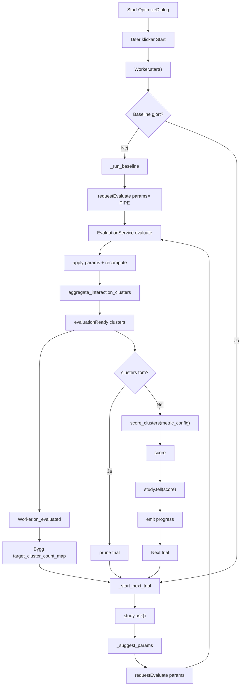
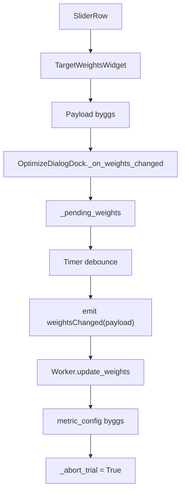
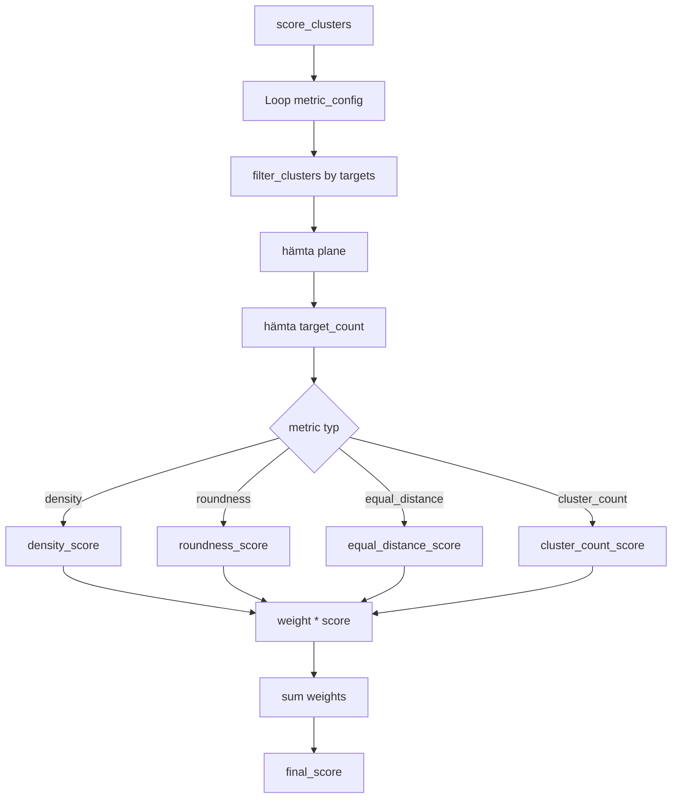
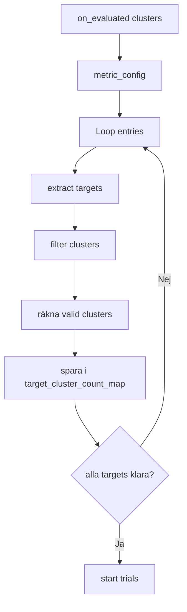

```mermaid

flowchart TD

A[Start OptimizeDialog] --> B[User klickar Start]

B --> C["Worker.start()"]
C --> D{Baseline gjort?}

D -- Nej --> E[_run_baseline]
E --> F[requestEvaluate params= PIPE]

F --> G[EvaluationService.evaluate]
G --> H[apply params + recompute]
H --> I[aggregate_interaction_clusters]
I --> J[evaluationReady clusters]

J --> K[Worker.on_evaluated]

K --> L[Bygg target_cluster_count_map]
L --> M[_start_next_trial]

D -- Ja --> M

M --> N["study.ask()"]
N --> O[_suggest_params]

O --> P[requestEvaluate params]

P --> G

J --> Q{clusters tom?}
Q -- Ja --> R[prune trial]
R --> M

Q -- Nej --> S["score_clusters(metric_config)"]

S --> T[score]
T --> U["study.tell(score)"]

U --> V[emit progress]
V --> W[Next trial]
W --> M

```

```mermaid
flowchart TD

A[SliderRow] --> B[TargetWeightsWidget]
B --> C[Payload byggs]

C --> D[OptimizeDialogDock._on_weights_changed]
D --> E[_pending_weights]

E --> F[Timer debounce]
F --> G["emit weightsChanged(payload)"]

G --> H[Worker.update_weights]

H --> I[metric_config byggs]
I --> J[_abort_trial = True]

```

```mermaid
flowchart TD

A[score_clusters] --> B[Loop metric_config]

B --> C[filter_clusters by targets]
C --> D[hämta plane]
D --> E[hämta target_count]

E --> F{metric typ}

F -- density --> G[density_score]
F -- roundness --> H[roundness_score]
F -- equal_distance --> I[equal_distance_score]
F -- cluster_count --> J[cluster_count_score]

G --> K[weight * score]
H --> K
I --> K
J --> K

K --> L[sum weights]
L --> M[final_score]
```

```mermaid
flowchart TD

A[on_evaluated clusters] --> B[metric_config]

B --> C[Loop entries]

C --> D[extract targets]
D --> E[filter clusters]

E --> F[räkna valid clusters]
F --> G[spara i target_cluster_count_map]

G --> H{alla targets klara?}
H -- Ja --> I[start trials]
H -- Nej --> C
```
